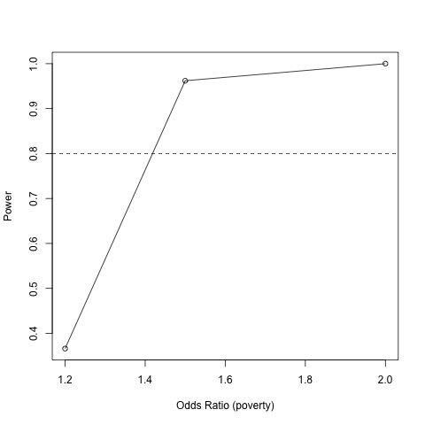

# phs2000b_powerSimulation

This is a power simulation example that we developed in PHS2000B Lab on  29 February 2024.

In class, we decided that we wanted to simulate power to detect a significant odds ratio for a cluster-level covariate from a logistic mixed effect model. 

Our general approach is:

1. Generate data from an appropriate data generating process under the alternative hypothesis. In this case, we wanted to build in several features to our data:
   (a) clustering, with 100 clusters with 100 subjects per cluster. Note that in this simple example, we simulated equal numbers of subjects per cluster, but we could choose to simulate more complex situations if we wanted.
   (b) a cluster-level exposure of interest (for which we want to compute power to detect a significant effect)
   (c) an individaul-level continuous covariate, in this case age
   (d) a binary outcome, for which we would need to fit a logistic mixed effect model
   (e) explore three different possible values for the strength of the association between cluster poverty at the outcome

3. For each simulated dataset, fit a logistic mixed effect model using lme4::glmer()
4. Save the p-value from the model.
5. At the end of the simulation, summarize the proportion of simulations in which we correctly conclude that the log odds ratio for the poverty effect is significantly different from zero.

Note that, as we saw in class, we had to tweak the code and calibrate the simulation parameters through trial and error. We noticed that sometimes the logistic mixed effect model failed to converge, and the software suggested that we might consider centering covariate. We thus centered age, and found that this solved the problem.

Note that glmer() does take some time to fit each model, so the entire simulation does take some time to run -- approximately an hour.

We only explored three values for the odds ratio relating cluster poverty to the odds of the binary outcome, but we can see that we have power of 80% and above for odds ratios as small as 1.4.
